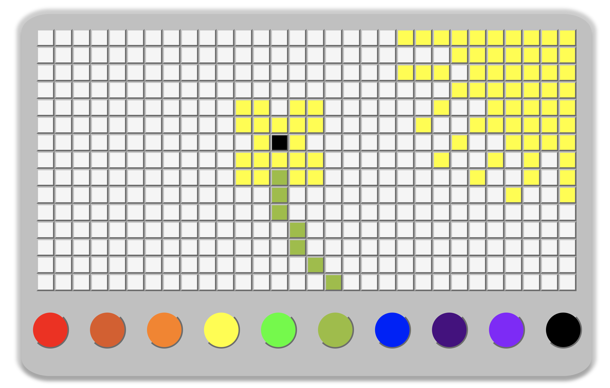

# Pixel Art Maker

## Description: 
A pixel art maker which allows a user to choose colors from a palette and paint pixel art

## Project Images:  

### 

### Technologies Used:
- Javascript
- HTML5
- CSS3
- Bootstrap

### Repo Link:
- https://github.com/reidgarner/pixel-art-maker

### Deployed site:
- http://reids-pixel-art.surge.sh/

### Installation and Run:
- $ npm install lite-server
- $ lite-server
